# 🚀 AI Team Platform - Complete Walkthrough

> **Welcome!** This visual guide will walk you through every step of using the AI Team Collaboration Platform, from your first login to exporting your results to GitHub. Get ready to see your AI team in action!

## Table of Contents

1. [Before You Start](#before-you-start)
2. [Step 1: Getting Started - Login & Registration](#step-1-getting-started---login--registration)
3. [Step 2: Dashboard Overview](#step-2-dashboard-overview)
4. [Step 3: Configuration](#step-3-configuration)
   - [3.1 Configuring AI Providers](#31-configuring-ai-providers)
   - [3.2 Configuring GitHub Integration](#32-configuring-github-integration)
5. [Step 4: Creating Your First Task](#step-4-creating-your-first-task)
6. [Step 5: Watching Your Team Work](#step-5-watching-your-team-work)
7. [Step 6: Reviewing Results](#step-6-reviewing-results)
8. [Step 7: Exporting to GitHub](#step-7-exporting-to-github)
9. [Step 8: Pull Request & CI/CD](#step-8-pull-request--cicd)
10. [Next Steps](#next-steps)

---

## Before You Start

This walkthrough assumes you have:
- ✅ Completed the installation process (see [README.md](./README.md) or [README-DOCKER.md](./README-DOCKER.md))
- ✅ The application running locally (default: http://localhost:5173)
- ✅ An API key from at least one AI provider (Anthropic Claude, OpenAI GPT-4, or Google Gemini)
- ✅ (Optional) A GitHub Personal Access Token for repository integration

If you encounter any issues, check our [TROUBLESHOOTING.md](./TROUBLESHOOTING.md) guide.

---

## Step 1: Getting Started - Login & Registration

When you first access the application, you'll see the login screen.

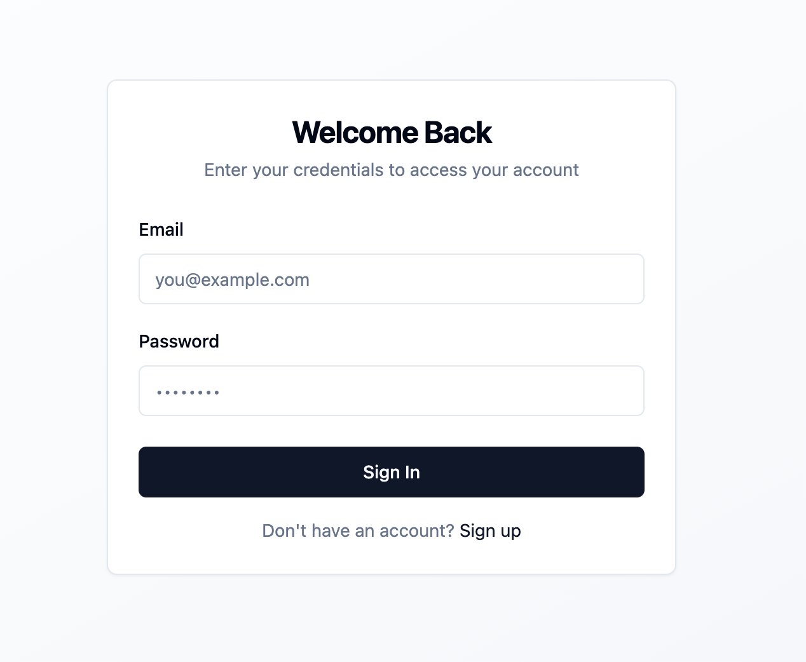

**Key Points:**
- Enter your email and password to access your workspace
- The application uses JWT authentication for secure access
- Your session persists across browser sessions

### Creating a New Account

If you're a new user, click the "Sign Up" link to create your account.

**Registration Requirements:**
- Valid email address
- Secure password (minimum 8 characters)
- Password confirmation

> 💡 **Tip**: Use a strong password and keep it secure. Your account will store API keys and GitHub tokens.

---

## Step 2: Dashboard Overview

After logging in, you'll land on the main dashboard - your command center for managing AI teams and tasks.

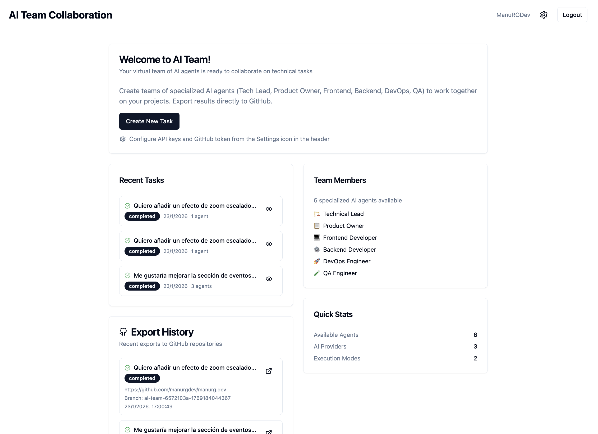

**Dashboard Widgets:**
- **Recent Tasks**: Quick access to your latest AI team collaborations
- **Team Members**: Overview of available AI agents and their specializations
- **Export History**: Track your GitHub integrations and pull requests
- **Quick Stats**: Overview of total agents, providers and available execution modes

**Important Actions:**
- Click **"Create New Task"** to start a new AI collaboration
- Access **Configuration** (⚙️ icon in header) to set up AI providers and GitHub

> ⚠️ **Note**: You must configure at least one AI provider before creating your first task.

---

## Step 3: Configuration

Before creating tasks, you need to configure your AI providers and optionally set up GitHub integration.

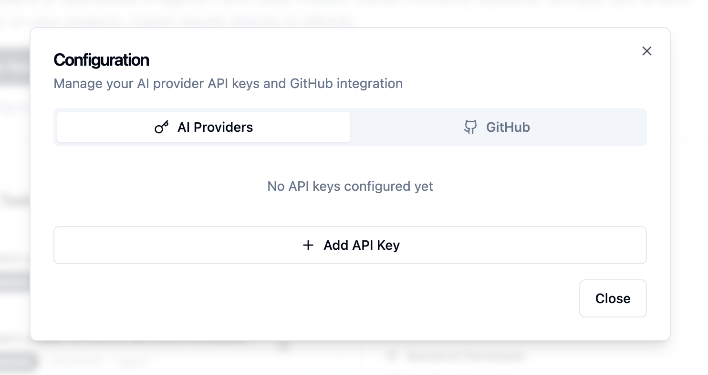

The configuration modal has two main sections: **AI Providers** and **GitHub Integration**.

### 3.1 Configuring AI Providers

#### Empty State

When you first open the configuration, you'll see the empty providers state.

Click **"Add API Key"** to get started.

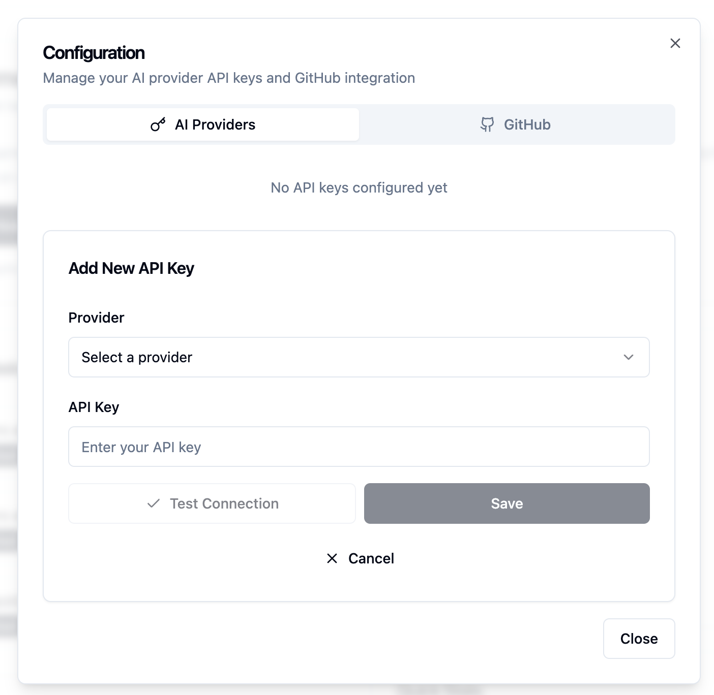

#### Selecting Your Provider

The platform supports three major AI providers. Choose the one you have an API key for.

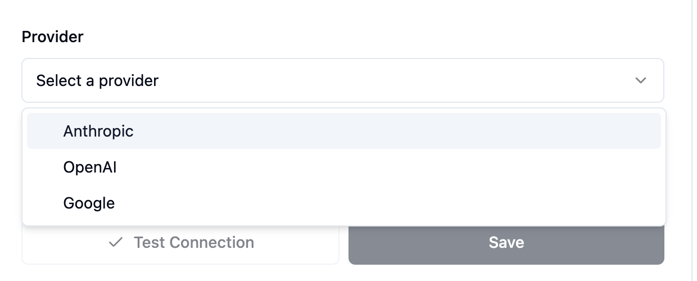

**Supported Providers:**
- **Anthropic** - Claude 4.5 Sonnet, Claude 4.5 Opus, Claude 4.5 Haiku
- **OpenAI** - GPT-4, GPT-4 Turbo, GPT-3.5 Turbo
- **Google** - Gemini Pro, Gemini Pro Vision

> 💡 **Tip**: You can configure multiple providers and switch between them when creating tasks.

#### Testing Your Configuration

After entering your API key, click **"Test Connection"** to verify it works.

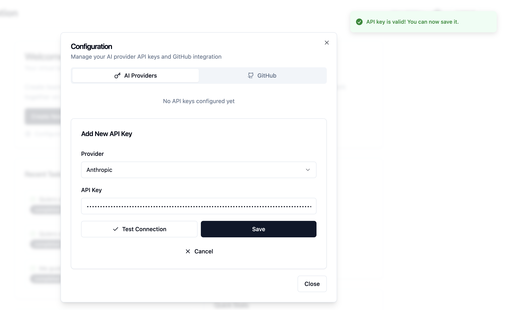

A successful test confirms:
- Your API key is valid
- The provider's API is accessible
- Your account has sufficient credits/quota

#### Saving Your Provider

Once tested successfully, save your configuration.

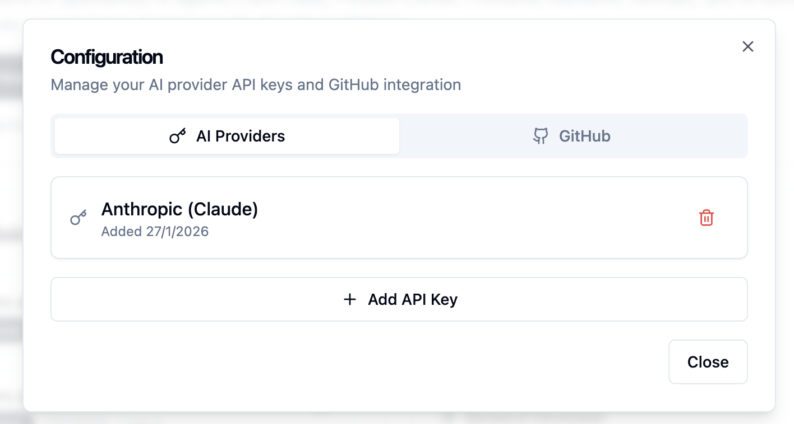

> 🔒 **Security**: API keys are encrypted and stored securely in the database.

### 3.2 Configuring GitHub Integration

GitHub integration is optional but recommended for exporting your AI-generated code directly to repositories.

#### Initial Setup

Navigate to the **GitHub** tab in the configuration modal.

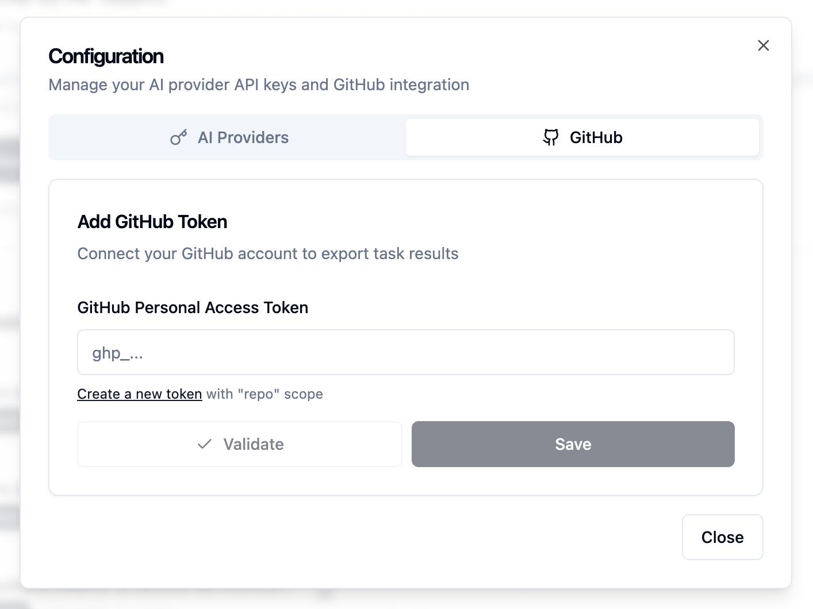

**What You Need:**
- A GitHub Personal Access Token (PAT)
- Token permissions: `repo` (full control of private repositories)

**Creating a GitHub Token:**
1. Go to GitHub.com → Settings → Developer settings → Personal access tokens → Tokens (classic)
2. Click "Generate new token (classic)"
3. Select scopes: `repo`, `workflow` (optional)
4. Copy the token immediately (you won't see it again!)

#### Testing GitHub Connection

After entering your token, test the connection to verify repository access.

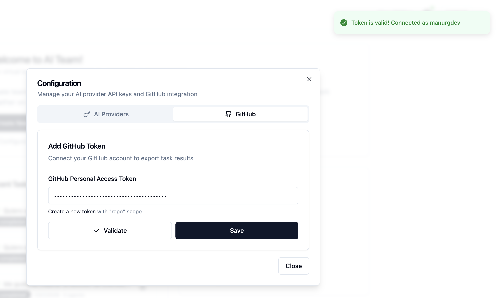

The test verifies:
- Token is valid and active
- Token has required permissions
- GitHub API is accessible

#### Saving GitHub Configuration

Save your GitHub token to enable repository features.

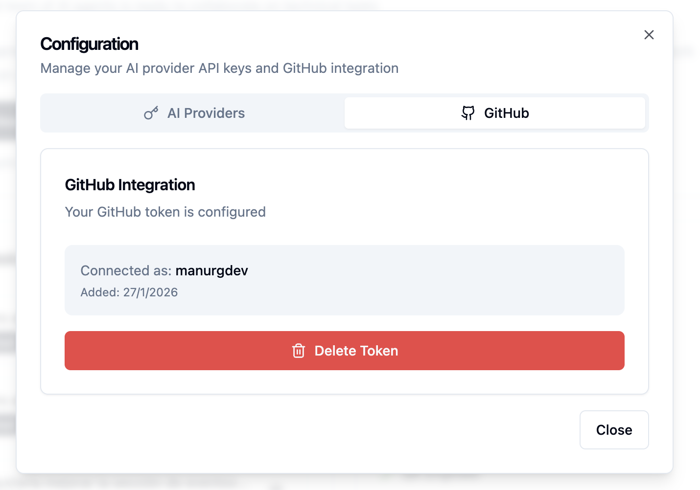

> 💡 **Tip**: You can now select repositories when creating tasks and export results directly to GitHub!

---

## Step 4: Creating Your First Task

Now for the exciting part - creating a task for your AI team to collaborate on!

### Task Creation Overview

Click **"Create New Task"** from the dashboard to access the task creation page.

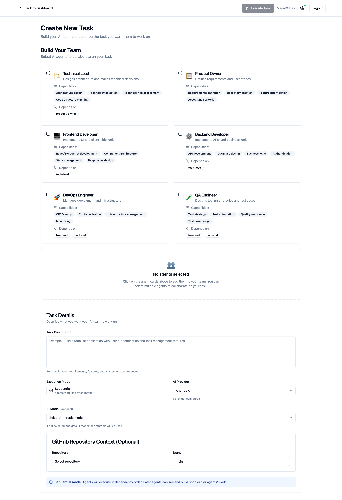

**Meet Your AI Team:**
- **Product Owner** - Requirements analysis, user stories, acceptance criteria
- **Tech Lead** - Architecture design, technical decisions, code structure planning
- **Frontend Developer** - UI components, styling, client logic
- **Backend Developer** - APIs, databases, server logic, authentication
- **DevOps Engineer** - CI/CD pipelines, Docker, deployment configurations
- **QA Engineer** - Test plans, validation, quality assurance, bug detection

Each agent card shows:
- Agent role and expertise
- Capabilities and technologies
- Selection checkbox

### Filling Task Details

Provide comprehensive information about what you want your AI team to build.

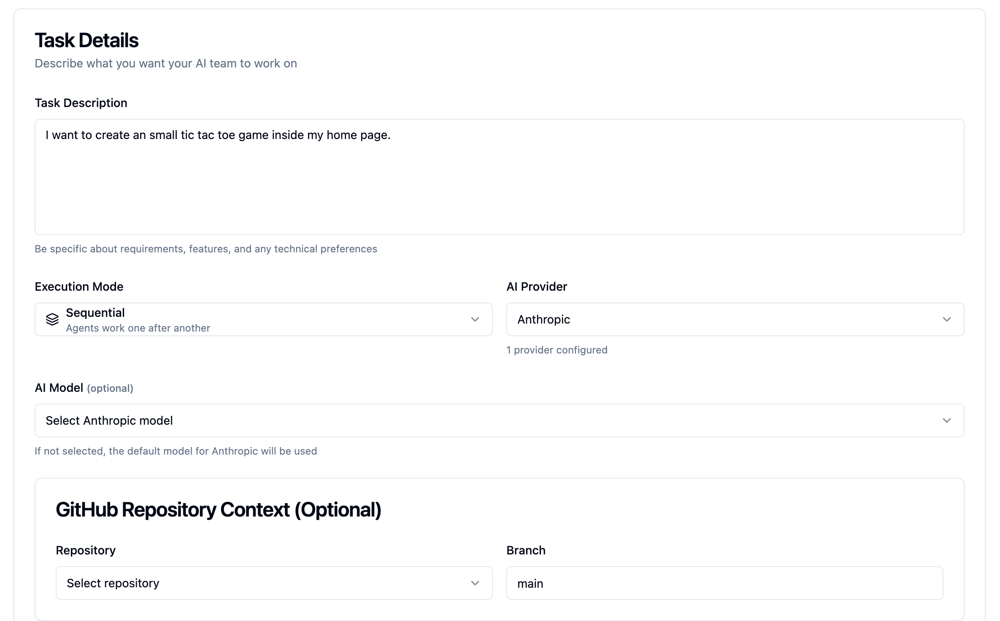

**Required Fields:**
- **Task Description**: Detailed description of what to build (be specific!)
- **Execution Mode**: How agents should work together
- **AI Provider**: Which LLM to use
- **AI Model**: Specific model version
- **GitHub Repository**: (Optional) Repository context for the agents

> 💡 **Tip**: The more detailed your description, the better your results. Include requirements, constraints, and expected outcomes.

### Choosing Execution Mode

Select how your agents should collaborate.

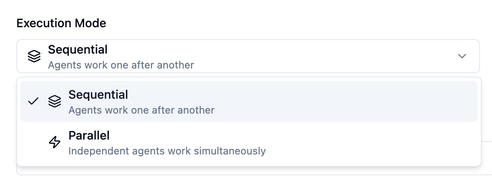

**Sequential Mode:**
- Agents work one after another
- Each agent sees the previous agent's output
- Best for tasks with dependencies (e.g., Product Owner → Tech Lead → Developers)
- Takes longer but ensures proper workflow

**Parallel Mode:** _(Experimental)_
- All agents work simultaneously
- Faster execution
- Best for independent tasks
- May lack coordination between agents

> 🎯 **Recommendation**: Use Sequential mode for complex features requiring coordination, Parallel mode for independent components.

### Selecting AI Model

Choose the specific AI model that will power your agents.

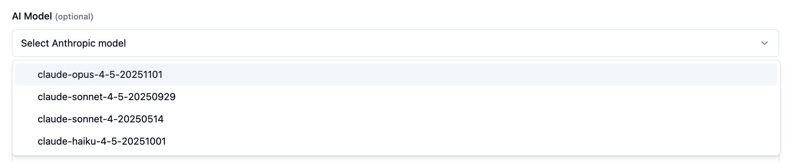

**Model Selection Factors:**
- **Capability**: More advanced models (GPT-4, Claude Opus) produce better results
- **Cost**: More advanced models are more expensive
- **Speed**: Smaller models (GPT-3.5, Claude Haiku) are faster
- **Context**: Some models have larger context windows for bigger codebases

> 💰 **Cost Awareness**: The platform tracks token usage and estimated costs per agent in real-time.

### Adding Repository Context

If you configured GitHub, you can select a repository to provide context to your agents.

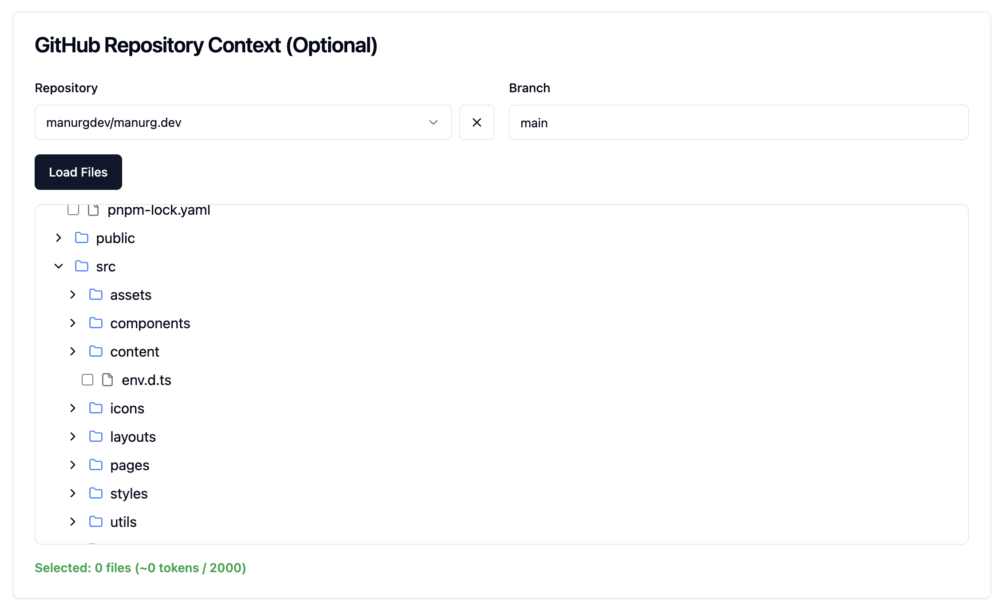

**Benefits of Repository Context:**
- Agents understand existing code structure
- Better integration with current codebase
- Consistent coding style and patterns
- Awareness of dependencies and architecture

### Selecting Agents

Choose which agents should work on this task.

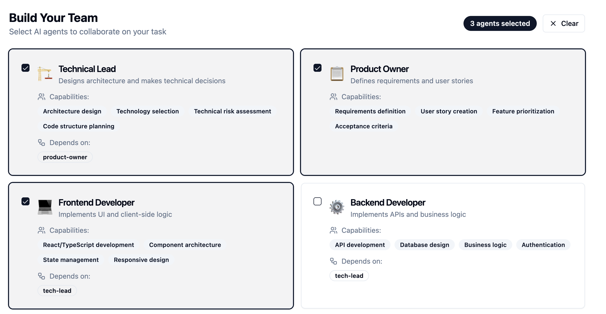

**Selection Tips:**
- For full-stack features: Select Product Owner, Tech Lead, Frontend Dev, Backend Dev, QA
- For frontend-only tasks: Product Owner, Frontend Dev, QA
- For infrastructure: DevOps, Tech Lead
- For each task, an additional agent called "Task Completion Validator" will run to check the whole task

> ⚠️ **Note**: In Sequential mode, agents execute in the order listed by dependecies. Plan your workflow accordingly.

Click **"Execute Task"** to start the AI collaboration!

---

## Step 5: Watching Your Team Work

Once you create a task, you're taken to the real-time execution view where you can watch your AI team collaborate.

### Execution Overview

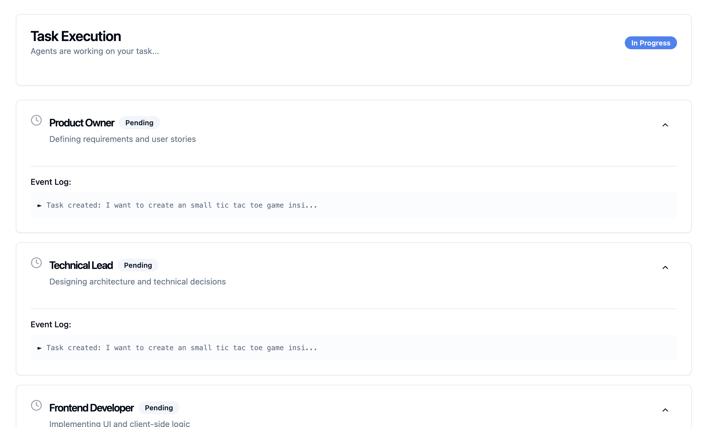

**What You See:**
- **Agent Cards**: One card per selected agent
- **Status Indicators**: Pending (gray), Running (blue), Completed (green), Error (red)
- **Progress Information**: Real-time updates via Server-Sent Events (SSE)
- **Execution Order**: Visual flow of agent collaboration

### Individual Agent Progress

Watch as each agent works on their part of the task.

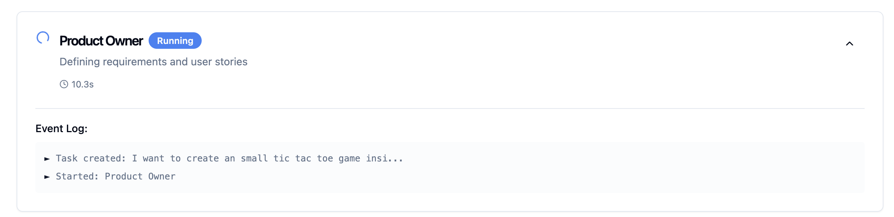

**Agent Progress Details:**
- **Elapsed Time**: How long the agent has been working
- **Status Updates**: Real-time streaming of agent actions
- **Current Activity**: What the agent is currently doing

> 💡 **Tip**: In Sequential mode, you'll see agents work one at a time. In Parallel mode, multiple agents run simultaneously.

### Cost Tracking

Monitor the cost of each agent's work in real-time.

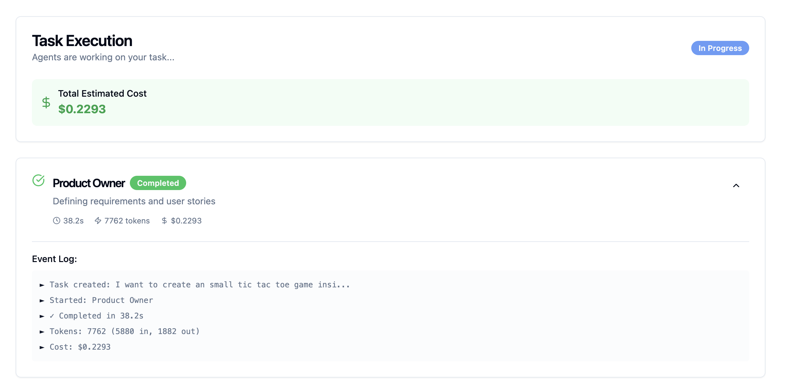

**Cost Information:**
- **Input Tokens**: Tokens consumed by agent's input (task description, context, prompts)
- **Output Tokens**: Tokens generated by agent's responses
- **Total Cost**: USD cost for this agent (based on provider pricing)

> 💰 **Budget Management**: Each agent's cost is calculated separately. The final summary shows total task cost.

### Sequential Execution Flow

In Sequential mode, agents work in order, each building on the previous agent's output.

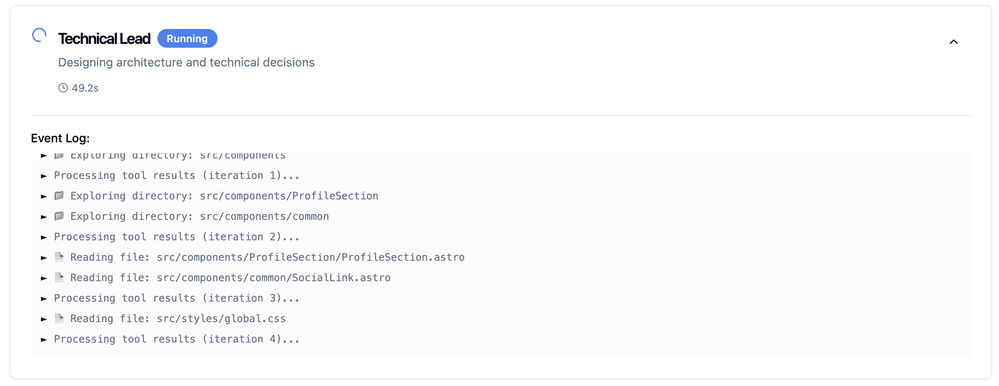

**Sequential Benefits:**
- Tech Lead sees Product Owner's requirements
- Developers see Tech Lead's architecture
- QA sees all previous outputs for comprehensive testing

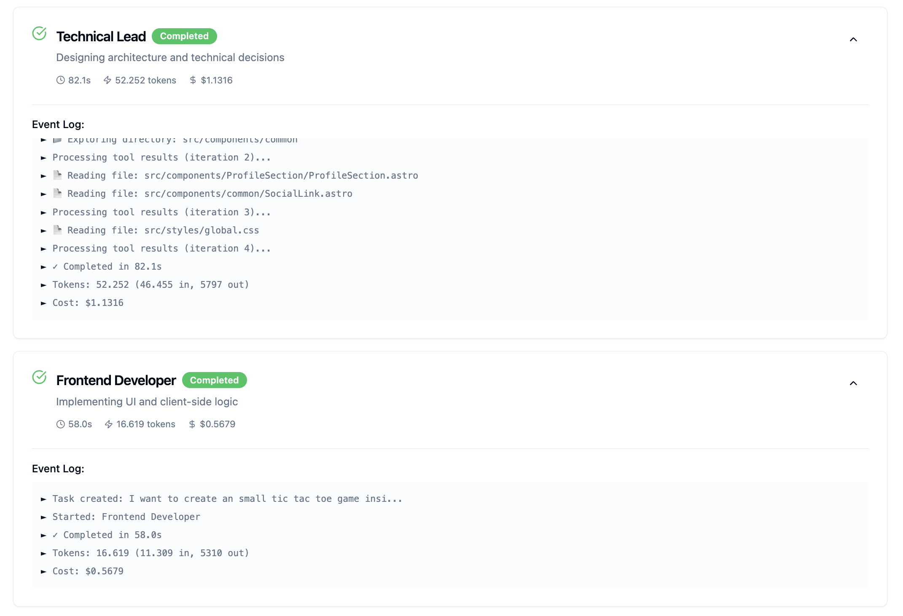

### Final Validation Phase

The "Task Completion Validator" agent performs final validation and quality checks.

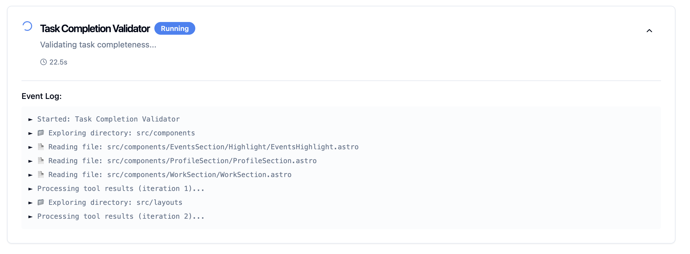

**Task Completion Validator Responsibilities:**
- Verify all requirements are met
- Check code quality and best practices
- Identify potential bugs or issues
- Validate integration between components
- Provide final approval or recommendations

### Task Completion

Once all agents finish, you'll see the completion summary.

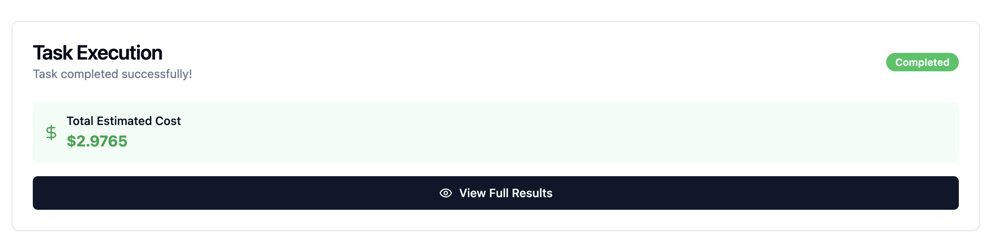

**Completion Summary:**
- ✅ All agents completed successfully
- 📊 Total execution time
- 💰 Total estimated cost breakdown (per agent and total)
- 📁 Number of files created
- 🔗 Link to view detailed results

> 🎉 **Success!** Click **"View Full Results"** to see what your AI team created.

---

## Step 6: Reviewing Results

After task completion, dive into the detailed results and artifacts created by your AI team.

### Results Overview

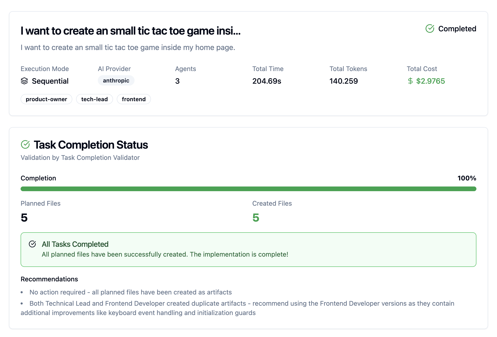

**Summary Information:**
- **Completion Status**: 100% indicates all agents completed successfully
- **Files Created**: Total number of files generated by all agents
- **Execution Time**: Total duration from start to finish
- **Total Cost**: Combined cost of all agents
- **Task Description**: Original requirements for reference

### Created Files

View all files generated by your AI team, organized by agent role.

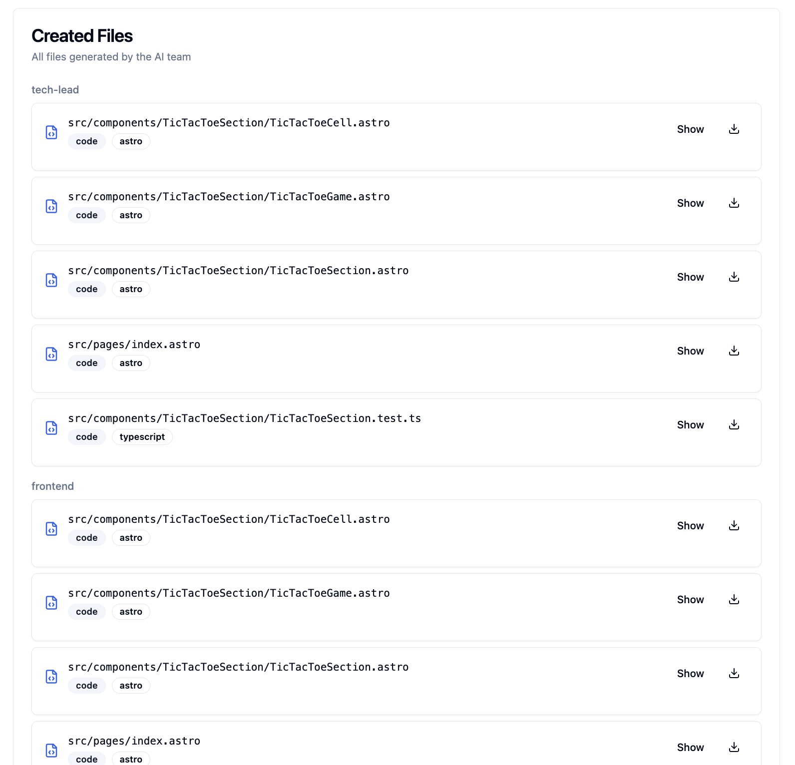

**File Organization:**
- Files grouped by the agent that created them
- File paths show directory structure
- Click any file to view its contents

### Agent Outputs

Review detailed outputs from each agent, including their reasoning and decisions.

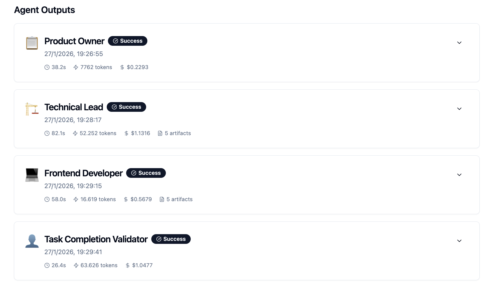

**Output Sections:**
- **Agent Role**: Which team member produced this output
- **Execution Time**: How long this agent worked
- **Token Usage**: Input/output tokens and cost
- **Output Content**: Full markdown-rendered response
- **Artifacts**: Extractable code blocks, configs, and files

#### Product Owner Output

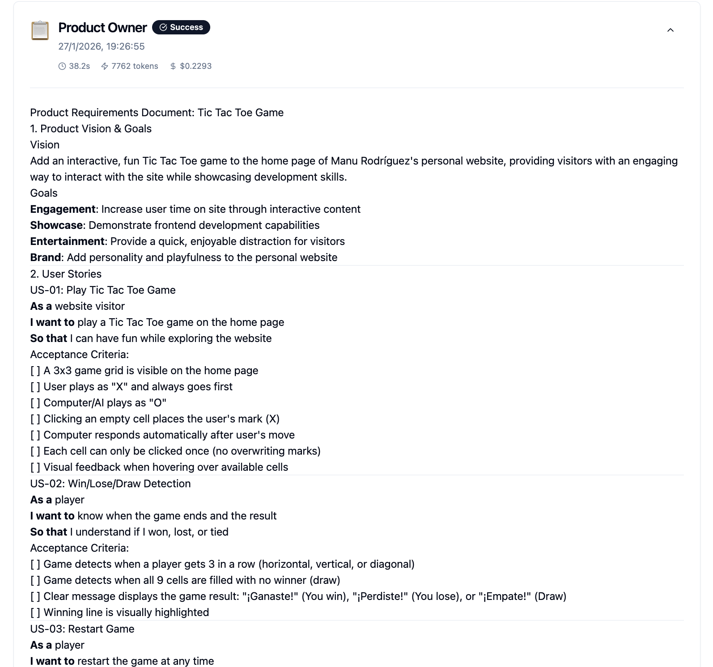

**Typical Product Owner Output:**
- **User Stories**: Detailed requirements as user stories
- **Acceptance Criteria**: How to validate success
- **Feature Specifications**: Functional and non-functional requirements
- **Priority Assessment**: What to build first
- **Edge Cases**: Scenarios to consider

#### Tech Lead Output

**Typical Tech Lead Output:**
- **Architecture Design**: System components and their interactions
- **Technology Stack**: Frameworks, libraries, and tools to use
- **Data Models**: Database schemas and relationships
- **API Design**: Endpoints, request/response formats
- **Technical Decisions**: Rationale for architectural choices
- **Implementation Plan**: Step-by-step development approach

#### Frontend Developer Output

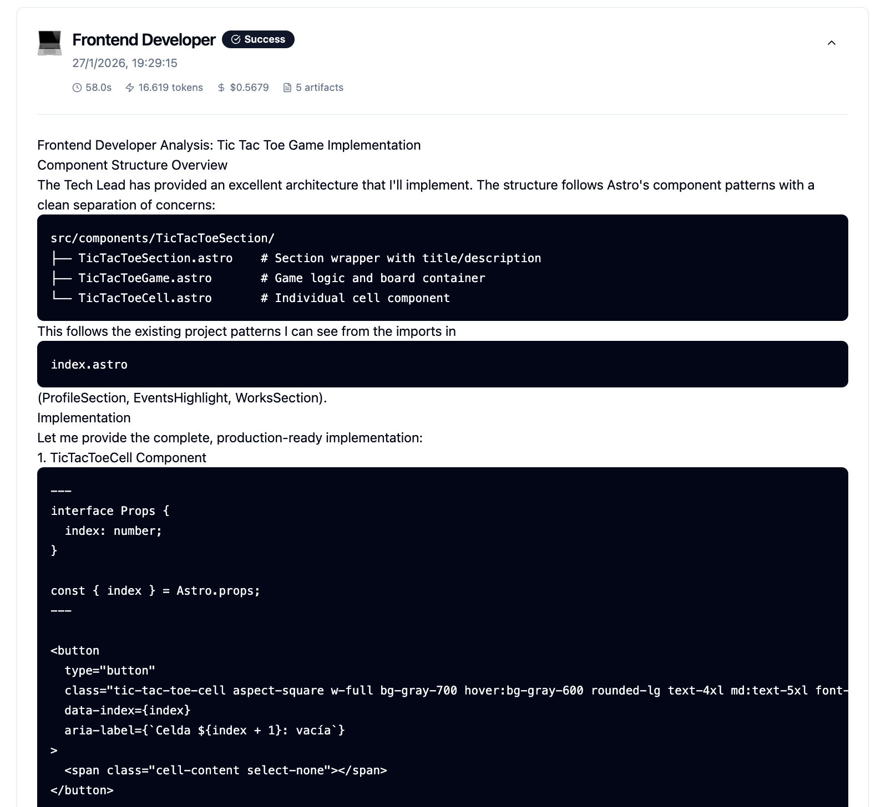

**Typical Frontend Output:**
- **React/Vue/Angular Components**: Full component code
- **Styling**: CSS, SCSS, or styled-components
- **State Management**: Redux, Context API, or Vuex setup
- **API Integration**: Service layer for backend communication
- **Responsive Design**: Mobile and desktop considerations
- **Accessibility**: ARIA labels, keyboard navigation

#### Task Completion Validator Output

**Typical Task Completion Validator Output:**
- **Quality Assessment**: Code review findings
- **Bug Report**: Issues discovered during validation
- **Recommendations**: Improvements and optimizations
- **Approval Status**: Whether the implementation meets requirements

### Final Validation Checklist

The Task Completion Validator agent provides a detailed checklist of validation results.

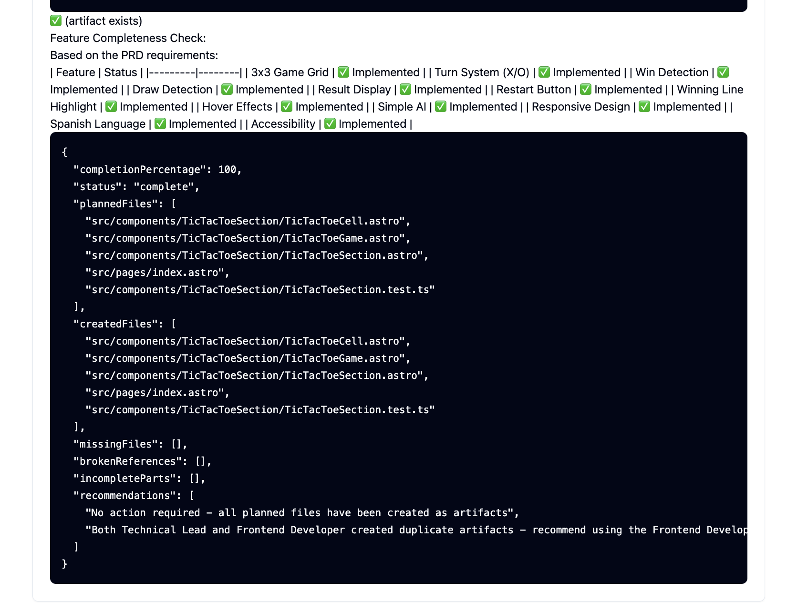

**Checklist Items:**
- ✅ Functional Requirements Met
- ✅ Code Quality Standards
- ✅ Error Handling Present
- ✅ Documentation Complete
- ✅ Security Considerations
- ✅ Performance Optimized
- ✅ Integration Successful

> 💡 **Tip**: Review the Task Completion Validator output carefully before exporting to GitHub. Address any warnings or recommendations first.

---

## Step 7: Exporting to GitHub

Ready to get your AI-generated code into a repository? Let's export it to GitHub!

### Export Interface

From the task detail page, look at **"Export to GitHub"** section.

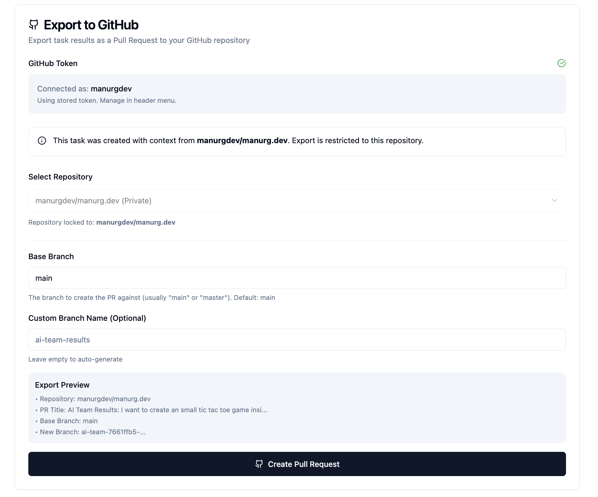

**Export Configuration:**
- **Target Repository**: Select from your configured GitHub repositories
- **Branch Strategy**: Create a new feature branch or use existing
- **Branch Name**: Auto-generated or custom (e.g., `feature/ai-generated-login`)

### Pre-Export Validation

Before exporting, after click "**Create Pull Request**" button, review the files that will be pushed to GitHub.

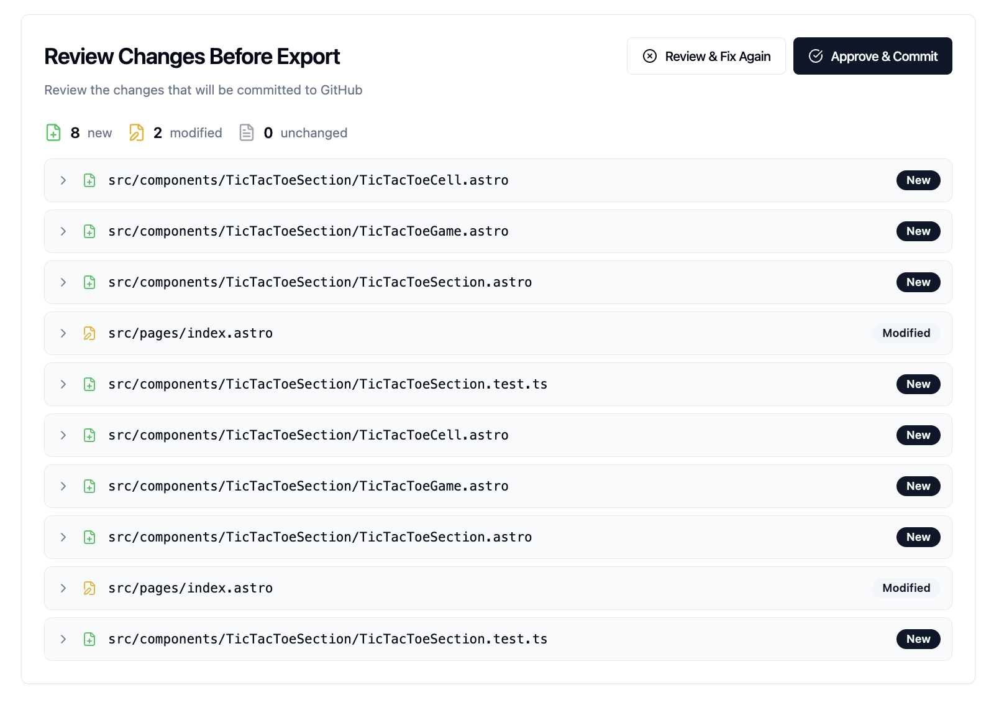

**Validation Steps:**
- **File List Review**: See all files to be exported
- **Conflict Detection**: Check for existing files that will be modified
- **Path Validation**: Ensure file paths are correct

> ⚠️ **Important**: This is your last chance to review before pushing to GitHub. Make sure everything looks correct!

### File Diff Preview

For files that will modify existing code, review the diff.

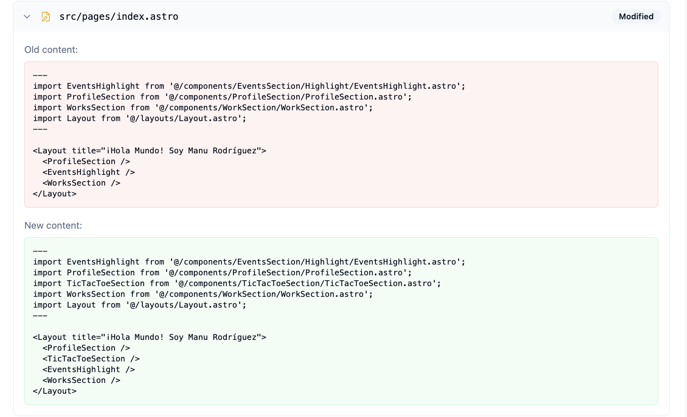

**Diff View Features:**
- **Side-by-Side Comparison**: Original vs. new content
- **Addition/Deletion Markers**: Green for new changes, red for old file

### New File Content Preview

For newly created files, review the complete content.

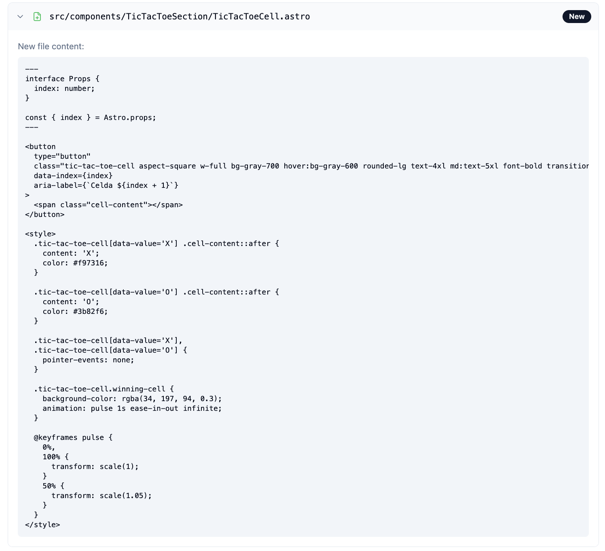

**Content Preview:**
- Full file content
- File path and type

### Exporting in Progress

Once you confirm, the export process begins.

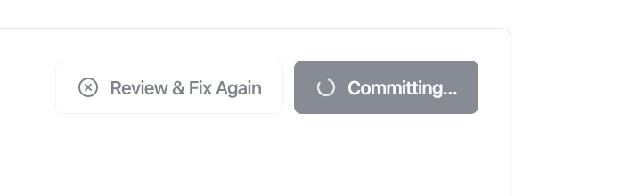

**Export Steps:**
1. Create feature branch from selected base branch
2. Commit all files with generated commit message
3. Push branch to remote repository
5. Trigger CI/CD workflows

### Export Completed

Success! Your code is now in GitHub.

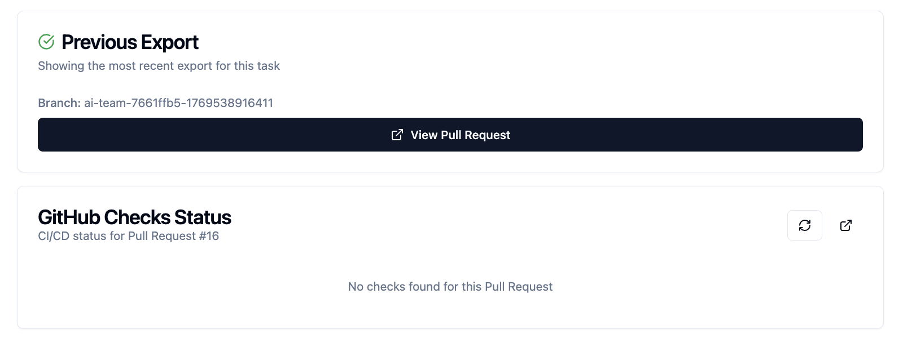

**Post-Export Information:**
- ✅ Branch created and pushed
- 🔗 Direct link to branch on GitHub
- 🚀 Pull request link (if created)

### GitHub Checks Running

If your repository has CI/CD configured, you'll see checks start automatically.

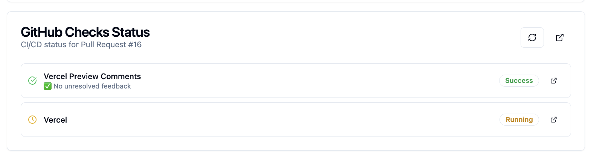

**Common Checks:**
- **Build**: Compile/bundle the application
- **Lint**: Code style and quality checks
- **Tests**: Unit, integration, and E2E tests
- **Security**: Dependency vulnerability scans
- **Coverage**: Code coverage requirements

### GitHub Checks Completed

Wait for all checks to complete successfully.

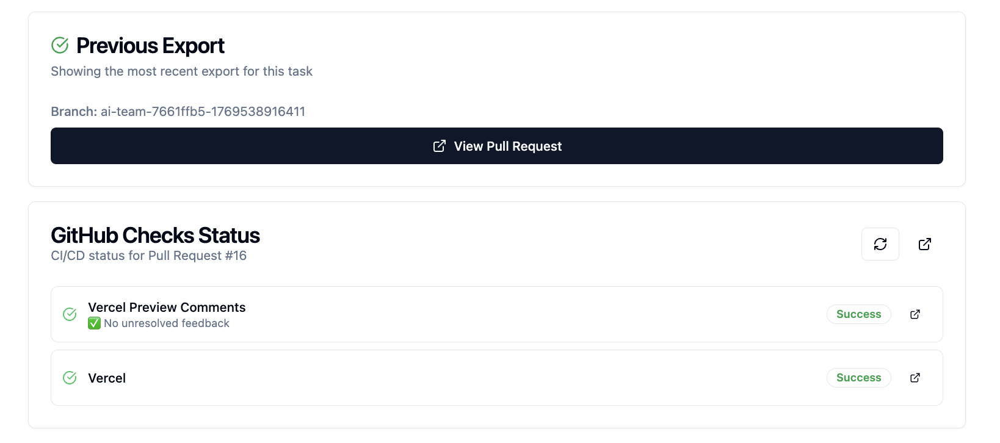

**Check Results:**
- ✅ All checks passed
- ⚠️ Some checks failed (review logs)
- 🔄 Some checks still running

> 🎯 **Best Practice**: Don't merge PRs until all checks pass. Review any failures and fix them.

---

## Step 8: Pull Request & CI/CD

Let's review the pull request created by the platform and the CI/CD pipeline results.

### Generated Pull Request Description

The platform creates a comprehensive PR description automatically.

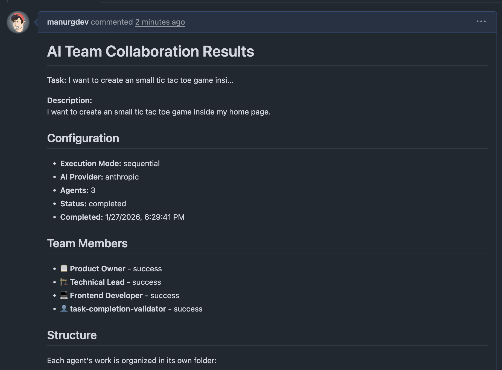

**PR Description Includes:** _(Experimental)_
- **Task Summary**: Original task description
- **Task Configuraiton**: Provider and execution mode used, status...
- **AI-Generated Badge**: Indicates this was created by AI Team Platform

> 💡 **Tip**: The PR description is editable. This part of the process is on a first step, and it can be changed to more accurate results.

### Pull Request File Changes

Review all file changes directly on GitHub.

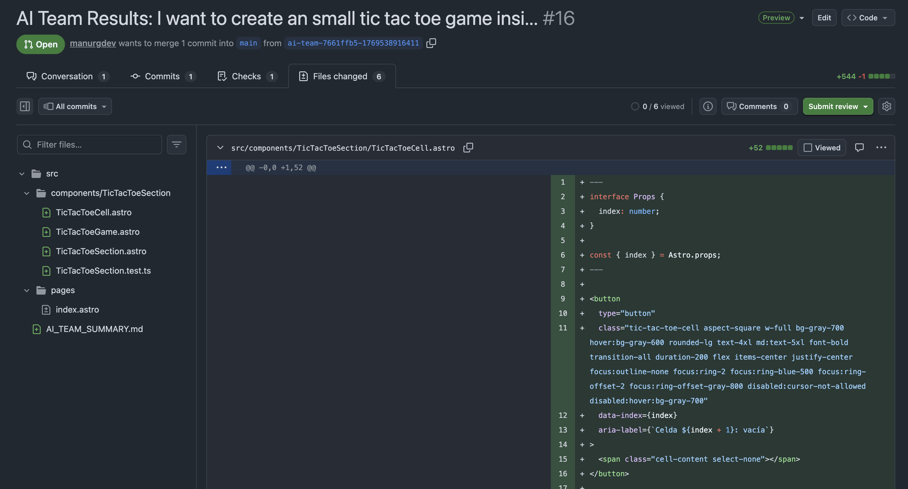

**GitHub PR Features:**
- **Files Changed Tab**: See all modifications
- **Diff View**: Line-by-line changes
- **Comments**: Add inline code review comments
- **Review Tools**: Approve, request changes, or comment
- **Merge Options**: Squash, merge, or rebase

**Review Checklist:**
- Does the code match requirements?
- Is the code quality acceptable?
- Are there any security concerns?
- Is the documentation sufficient?
- Do tests cover the new functionality?

### Testing the Feature

Now it's time to test the implemented feature to ensure it works as expected.

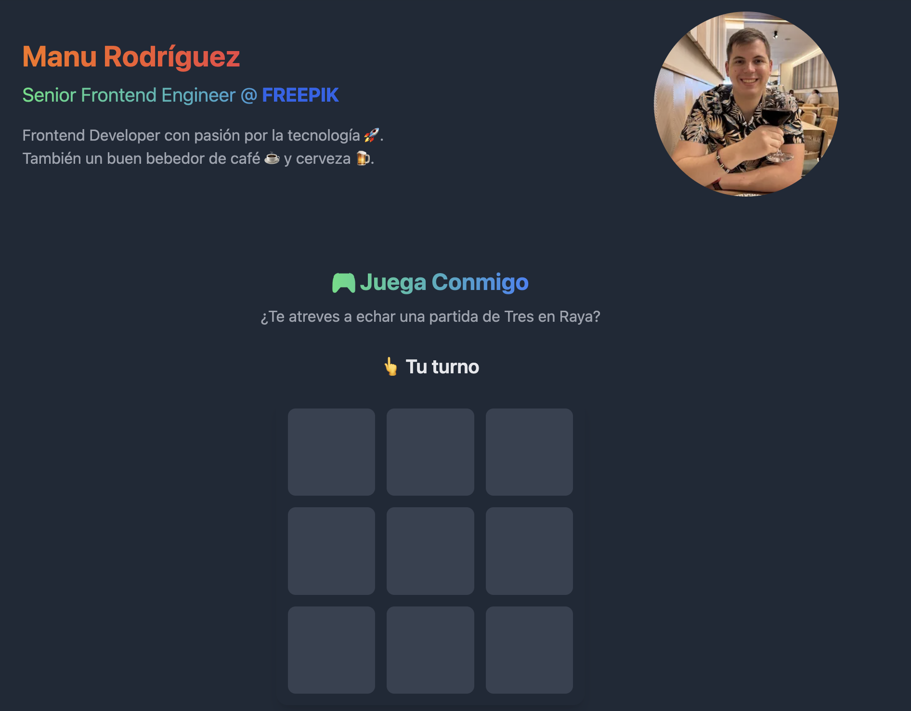

**Testing Steps:**
1. **Deploy/Run the Application**: Start the application with the new feature
2. **Functional Testing**: Verify the feature behaves as specified
3. **User Flow Testing**: Test complete user interactions
4. **Edge Cases**: Test boundary conditions and error scenarios
5. **Integration Testing**: Ensure the feature integrates properly with existing functionality
6. **UI/UX Validation**: Check visual appearance and user experience

### Successful Feature Validation

The feature works correctly and is ready for review!

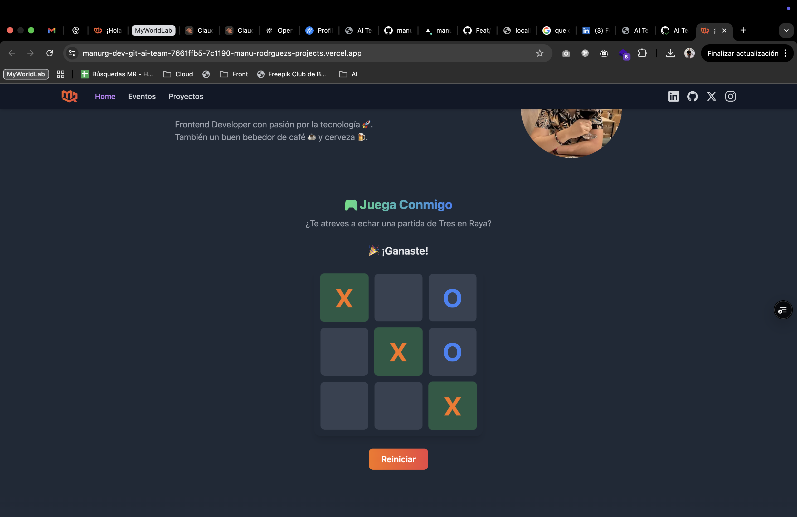

**Validation Results:**
- ✅ Feature functions as specified in requirements
- ✅ User interface renders correctly
- ✅ All interactions work smoothly
- ✅ No console errors or warnings
- ✅ Integrates properly with existing features
- ✅ Performance is acceptable

**Next Steps:**
1. Request code review from your team
2. Address any feedback or change requests
3. Merge the pull request when approved
4. Deploy to staging/production (if automated)
5. Monitor for any issues in production

> 🎉 **Congratulations!** You've successfully used the AI Team Platform to go from idea to production-ready code with automatic GitHub integration!

---

## Next Steps

Now that you've completed your first AI team collaboration, here are some ways to level up:

### 🚀 Advanced Features

- **Multiple Providers**: Configure all three AI providers and compare results
- **Custom Agent Selection**: Tailor agent teams for specific task types
- **Parallel Execution**: Use parallel mode for independent features
- **Repository Context**: Leverage existing codebases for better integration

### 📚 Learn More

- **[README.md](./README.md)** - Technical documentation and API reference
- **[README-DOCKER.md](./README-DOCKER.md)** - Docker deployment guide
- **[TROUBLESHOOTING.md](./TROUBLESHOOTING.md)** - Common issues and solutions
- **[CONTRIBUTING.md](./CONTRIBUTING.md)** - Contribute to the project

### 💡 Best Practices

1. **Write Detailed Task Descriptions**: The more context you provide, the better the results
2. **Choose the Right Model**: Balance cost, speed, and quality for your needs
3. **Review Before Export**: Always check QA output and file contents before pushing to GitHub
4. **Use Sequential Mode for Complex Tasks**: Ensures proper coordination between agents
5. **Monitor Costs**: Keep an eye on token usage to stay within budget
6. **Iterate and Refine**: Use failed tasks as learning opportunities

### 🤝 Community & Support

- **Issues**: Report bugs or request features on [GitHub Issues](https://github.com/manurgdev/ai-team/issues)
- **Discussions**: Share ideas and ask questions
- **Contributing**: Help improve the platform (see CONTRIBUTING.md)

### 🔬 Experimental Features

This is an experimental learning project. Some features to watch for:
- Enhanced agent collaboration protocols
- Multi-model task execution (different models per agent)
- Custom agent creation and specialization
- Integration with additional AI providers
- Advanced context management for large codebases

---

**Happy Building! 🎉**

Remember, this platform is a learning tool for exploring AI-powered software development. Use it responsibly, review all generated code, and always apply human judgment before deploying to production.

---

*Generated by the AI Team Collaboration Platform - Where AI agents work together to bring your ideas to life.*
